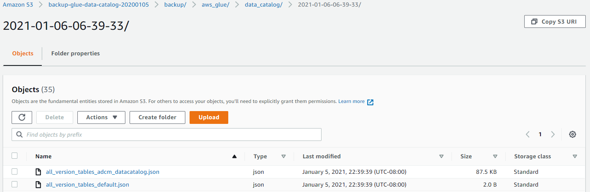
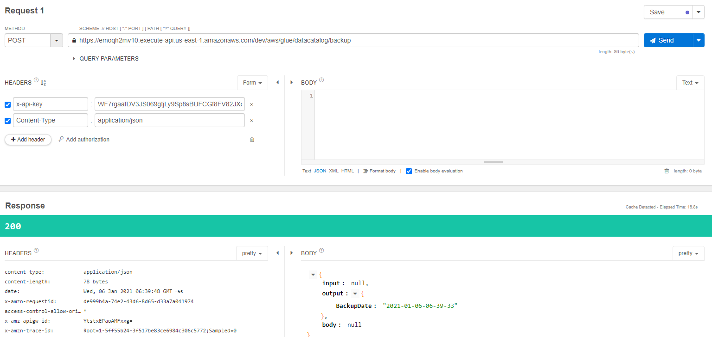
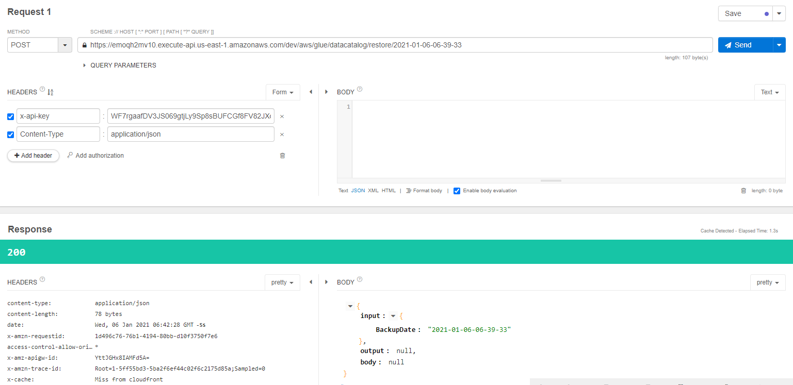

# Backup AWS Glue Data Catalog using Serverless Framework (Python 3)

Backup data catalog to AWS S3


REST API: Backup


REST API: Restore


## Index
<!-- TOC -->

- [Backup AWS Glue Data Catalog using Serverless Framework (Python 3)](#backup-aws-glue-data-catalog-using-serverless-framework-python-3)
  - [Index](#index)
- [How to deploy](#how-to-deploy)
  - [Setup: AWS Credentials on your PC](#setup-aws-credentials-on-your-pc)
  - [Setup: Serverless Framework on your PC](#setup-serverless-framework-on-your-pc)
  - [git clone](#git-clone)
  - [Update: config](#update-config)
  - [Create a service directory](#create-a-service-directory)
  - [Deploy a service](#deploy-a-service)
  - [Debug: Create & Delete AWS Budget](#debug-create--delete-aws-budget)
  - [Debug: Rest API](#debug-rest-api)
  - [Delete a service](#delete-a-service)
  - [Deployment logs](#deployment-logs)

<!-- /TOC -->

# How to deploy

## Setup: AWS Credentials on your PC
```
$ cat ~/.aws/credentials 
[default]
aws_access_key_id= [Your ID]
aws_secret_access_key= [Your Key]
aws_session_token= [Your Token]
region= [Your AWS Region (eg: us-east-1)]
```

## Setup: Serverless Framework on your PC
```
$ python -V
Python 3.7.9

$ pip3 -V
pip 9.0.3 from /usr/lib/python3.7/site-packages (python 3.7)

$ npm -v
6.14.8

$ npm install -g serverless
...

$ sls -v
Framework Core: 2.17.0
Plugin: 4.4.1
SDK: 2.3.2
Components: 3.4.3
```

## git clone
```
$ git clone https://github.com/YuyaIsoda/aws-backup-glue-data-catalog.git
```

## Update: config
Please **MUST** set:
- **Region**: AWS Region Name
- **Bucket**: AWS S3 Bucket Name

```
$ cat conf/sls_conf
# Serverless Framework: Settings
export ServiceName='aws-backup-glue-data-catalog'
export SLSDIR='serverless'
export Region='us-east-1'
export Stage='dev'

# Environment variable
export Bucket='backup-glue-data-catalog-20200105' # AWS S3 Bucket Name
```

## Create a service directory
```
$ cd common/
$ sh sls_create.sh
...
/home/ec2-user/serverless/aws-backup-glue-data-catalog
|--aws_common.py
|--env
|  |--dev.yml
|  |--prod.yml
|--.gitignore
|--handler.py
|--h_backup_glue_catalog.py
|--h_conf.py
|--serverless.yml
|--sls_conf
|--sls_create.sh
|--sls_deploy.sh
|--sls_install.sh
|--sls_remove.sh
```

## Deploy a service
```
$ cd ~/serverless/aws-backup-glue-data-catalog/
$ sh sls_deploy.sh 
...
Service Information
service: aws-backup-glue-data-catalog
stage: dev
region: us-east-1
stack: aws-backup-glue-data-catalog-dev
resources: 27
api keys:
  aws-backup-glue-data-catalog: WF7rgaafDV3JS069xxxxxxxxxxxxxxxx
endpoints:
  POST - https://emoqh2mv10.execute-api.us-east-1.amazonaws.com/dev/aws/glue/datacatalog/backup
  POST - https://emoqh2mv10.execute-api.us-east-1.amazonaws.com/dev/aws/glue/datacatalog/restore/{BackupDate}
functions:
  backup: aws-backup-glue-data-catalog-dev-backup
  restore: aws-backup-glue-data-catalog-dev-restore
layers:
  None
```

## Debug: Create & Delete AWS Budget
```
$ cd ~/serverless/aws-backup-glue-data-catalog/
$ source bin/activate
$ source sls_conf

$ sls invoke -f backup --log
... (No Error)
```

## Debug: Rest API
REST API: Backup


REST API: Restore


## Delete a service
```
$ cd ~/serverless/aws-backup-glue-data-catalog/
$ sh sls_remove.sh 
...
```

## Deployment logs
```
$ ll ~/serverless/log/
...
```
